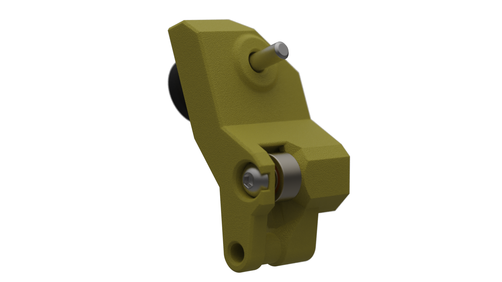

# WW-BMG for A4T

A modified version of the [Wristwatch BMG](https://github.com/bythorsthunder/Voron_Mods/tree/main/Wristwatch_Extruder_BMG) extruder from [bythorsthunder](https://github.com/bythorsthunder).
This version has been made compatible with A4T by removing a small notch from the motor plate and changing the extruder mounting pattern from Orbiter 2 spacing to Sherpa-Mini spacing.
- This version has been optimised to work as well as possible with the RIDGA v2 drive gear.
- Multiple filament path improvements
- Options added for:
  - Smooth bearing idler, and
  - Dual fialment sensors

--------------------

## Multiple options for WW-BMG for A4T
Choose your own adventure
### * Standard Extruder
### * Dual fialment sensor
### * Smooth bearing idler or BMG 2nd drive gear tension arms

--------------------

## Bill of Materials (BOM)

### Needed for all variants
- 1x M3x25 BHCS screw
- 2x DIN562 M3 Square nut
- 1x Bondtech RIDGA (optional but highly recommended), its mounting bearings and tensioning thumbscrew with spring and nylon washer
- 1x M3x16 SHCS `to attach NEMA 17 stepper motor. Length correct if using threaded stand-offs for toolhead board mounting.`
- 1x M3x12 SHCS `to attach NEMA 17 stepper motor. Length correct if using threaded stand-offs for toolhead board mounting.`
- 1x ECAS 4mm `⚠️ Remove both the black plastic and rubber parts from the bottom.`

### BMG 2nd drive gear tension arm (parts usually included with BMG gear kits)
- 1x M3x20 steel dowel 
- 2x needle bearings
- 1x BMG secondary drive gear

### Smooth idler tension arm
This version of the tension arm uses a bearing instead of the toothed secondary drive gear. It is primarily aimed at **reducing potential extrusion consistency artefacts** caused by slight system misalignments.
- 1x 693ZZ bearing
  Make sure the bearing dimensions are:
  - **8 mm OD**
  - **3 mm ID**
  - **4 mm width** `Some 693 bearings are 3mm wide which is too narrow, so pay attention to this one!`
- 1x M3x12 BHCS
- 4x M2x10 self tapping screw

### Dual filament sensor main body
- 2x D2F or equivalent microswitch `Connecting pins need to be trimmed to approximately 2mm before soldering wires`
- 2x 5.5mm ball bearing
- 1x MR63zz bearing
  - **6 mm OD**
  - **3 mm ID**
  - **2.5 mm width**
- Thin wire 28 or 26 AWG `enough to connect pins back to required toolhead board or MCU`

### Standard extruder
`No extra parts`

## Printed Parts
- Standard extruder: [Standard (no sensor)](<Standard (no sensor)>)
  - print both parts
- Dual Sensor extruder: [Dual Sensor](<Dual Sensor>)
  - Print 1x Main Body part `The "Bearing -0.1" and "Bearing -0.2" main body parts move the switch closer to the filament path. May be usefull if top sensor is not falsly triggering when filament is in place"
  - Print 1x Motor Plate part
- Tension Arm
  - Print either the BMG_Idler or Smooth_Idler tension arm part
- Extras
  - The extrusion Motion Indicator can be used with 1x 6mm x 3mm magnet and placed on the front of the main gear to give a visual indication of extruder movement.

### Print Settings
Use the same settings as the **A4T toolhead**.

- **Avoid seams** in filament sensor paths – seams may cause slight bulging, making the bearings bind. If necessary use seam painting and blockers in your slicer to do so.
- A **well-calibrated printer** is essential for proper sensor actuation.
- If the sensor bearing holes are too tight:
  - Adjust filament flow rate (EM)
  - Reduce print speed
  - Tweak shrinkage compensation

## Assembly & Setup

### Remove the Built-in Tensioner Arm Support
This supports should come away easily and is the only support used. 

### Tension Arm Assembly

#### Smooth Idler Version
1. Insert the `693` bearing into the smooth idler.
2. Insert the `M3x12` screw from the back. `⚠️ **Do not overtighten** — the screw threads into plastic`
3. There should be slight play in the bearing (up/down and side-to-side) — this is **intentional** to allow the idler to self-center on the filament path. 

> [!TIP] 
> The smooth idler tensioner requires slightly **higher tension** than the standard secondary drive gear tensioner 
> - Tighten the spring tensioner **until the idler arm no longer moves**.
> - Then tighten **3–4 turns further** to set the proper tension. Run some filament through and observe how squished it is against both the teeth and the bearing. You should get a good imprint of the teeth on the filament without the filament flattening much on the bearing side.

#### BMG Secondary Gear Idler Version
1. Place the 2x needle bearings over the 3mm x 20mm steel dowl.
2. Add a small amount of appropriate grease.
3. Install secondary drive gear over the needle bearings.
4. Install assembled secondary gear parts onto printed tension arm. `Snap fit` 

## Main Body Assembly
1. Install ECAS adapter into the top of the main body part `Make sure you have removed both the rubber base and black plastic ring from the bottom`

2. Filament Sensors (Dual sensor version only) 
    
   1. Solder wires to your two switches `NO or NC wiring will depend on your MMU or Klipper configuration. Refer to MMU or Klipper for direction`
   2. Start with the lower sensor
      1. Place the `MR63zz` Bearing into the slot.
      2. Install the switch with 2x `M2x10 self tapping screws`
      3. Ensure wiring will run into the wiring channel without exiting the open back of the extruder.
   3. Install the upper sensor
      1. Put some filament in place in through the extruder
      2. Place 2x `5.5mm ball bearings` into the bearing tube.
      3. Install the switch with 2x `M2x10 self tapping screws`
         1. The switch should be triggered at this stage, as there is filament in place.
         2. Test putting in and taking out filament multiple times from various insertion angles by hand to be sure that there are no snags, and that you hear the switch "click" as filament is inserted and removed.
      4. Ensure wiring will run into the wiring channel without exiting the open back of the extruder.
   4. Run all of the wires up through the upper wiring chanel
   
3. Install the 2x drive gear bearings that came with the RIDGA (or other) BMG kit
   1. Into the main body, and
   2. Into the motor plate

4. Place the RIDGA main drive gear into the main body `It can be a little tight to push the gear teeth into the main body`

5. Install the 2x `DIN562 M3 Square nuts`
   1. Into the back of the motor plate
   2. Into the top of the main body where the tension arm will tighten against

6. Attach the motor plate to the main body
   1. Align the rear bearing over the back of the main gear shaft
   2. Requires a slight twist to lock into place

7. Attache the NEMA17 stepper motor
   1. 1x `M3x16 SHCS` in the upper, non-adjustable, screw hole
   2. 1x `M3x12 SHCS` in the lower screw slot
      1. Adjust backlash apporpriately and tighten both screws

8. Install Idler Tension Arm
   1. Put the tension arm into place
   2. Install with `M3x25mm BHCS`
   3. Install tensioning thumbscrew with spring and nylon washer through the tension arm and screw into the squre nut in the main body

## Calibration & Use
After installing the extruder re-calibrate your:
  - **Rotation distance**
  - **Pressure advance**

Expect both to need adjustment due to the changed filament path and tensioning method.

## Credits
- [bythorsthunder](https://github.com/bythorsthunder) for the original WW-BMG Extruder
- [igiannakas](https://github.com/igiannakas) for the smooth bearing idler and multiple filament path improvements
- jeremytodd1 because "it's the end of the broomstick" 😉
- igiannakas and jeremytodd1 for the masses of pre-release testing